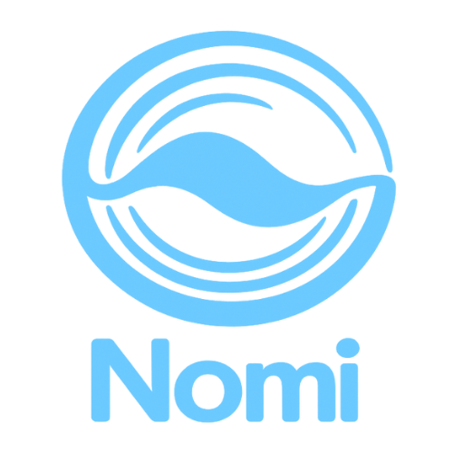

<p align="center">
  
</p>

# Nomi — AI Voice-First Language Practice Companion

A calm, voice-first AI companion designed to help people practice speaking a new language without pressure, scores, or gamification.

Nomi focuses on **natural conversation**, emotional safety, and consistent speaking practice — like a short phone call with a trusted buddy.

**Live demo:** https://nomi-kappa.vercel.app
**Full source repository:** Private (available on request)

---

## Overview

Nomi is a full-stack AI application that allows users to practice speaking a language through natural conversation.

The system combines browser speech recognition, a conversational AI backend, and a minimalist interface designed to reduce cognitive load and performance anxiety.

Key goals:

* Encourage consistent speaking practice
* Remove pressure from language learning
* Provide calm, supportive conversational feedback
* Maintain a simple and distraction-free interface

---

## Core Features

* **Voice-first interaction** using browser speech recognition
* **AI conversational responses** powered by OpenAI
* **Adaptive conversation modes** (adult / kid personas)
* **Multilingual interface** (English, German, French, Spanish — Italian planned)
* **Trial access + subscription system** via Stripe
* **Minimalist UI** designed for calm interaction

---

## Architecture Overview

```
Browser (Next.js)
   ↓
Speech Recognition (Web Speech API)
   ↓
FastAPI Backend
   ↓
OpenAI API (gpt-5-mini)
   ↓
Response returned to frontend
   ↓
Speech synthesis (TTS)
```

### Frontend

* Next.js (App Router)
* TypeScript
* Web Speech API (speech recognition)
* SpeechSynthesis API (text-to-speech)
* TailwindCSS

### Backend

* Python
* FastAPI
* OpenAI Responses API

### Infrastructure

* Supabase (PostgreSQL + authentication)
* Stripe (subscriptions and trials)
* Vercel (frontend hosting)
* Render (backend hosting)

---

## Deployment

Frontend: Vercel
Backend: Render

Production URL:
https://nomi-kappa.vercel.app

---

## Development Status

Nomi is currently a **production prototype** and continues to evolve as new features are implemented and refined.

Planned improvements include:

* Settings UX improvements
* Subscription management portal
* Usage monitoring and rate limiting
* Progressive web app support

---

## About the Project

Nomi is being developed as an independent project exploring how AI can support language learning through conversation rather than traditional exercises.

The full source code repository is currently private while the application continues to evolve.

Access to the private repository can be provided upon request.

---

## Author

Frederic G. Fleron Grignard
Software Engineer — Berlin

GitHub: https://github.com/F-Fleron-G
