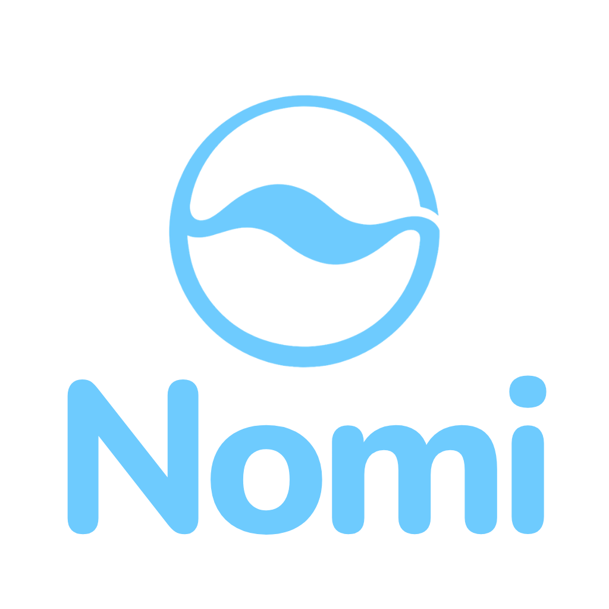

  

# Nomi — Voice-First AI Language Practice Companion

A production-ready AI web application that helps people practise speaking languages through calm, natural conversation. Designed around emotional safety rather than pressure, Nomi feels more like a short call with a trusted companion than a traditional language lesson.

## Live Demo

https://nomisays.app

## Development Stage

Public beta • Early user testing

Nomi is currently available online and is being refined through real-world testing before wider public release.

---

## Overview

Nomi is a production-ready full-stack AI web application designed around real speaking practice.

Instead of exercises, streaks, or performance pressure, Nomi encourages natural conversation in a calm environment where users can build confidence gradually.

Core principles:

- Confidence before correctness
- Real conversation instead of exercises
- Gentle 15–30 minute practice sessions
- Calm and emotionally safe interaction
- Mobile-first experience

---

## Core Features

- Voice-first language practice
- AI conversational interaction
- Speech-to-text transcription
- Text-to-speech voice responses
- Adult and child modes
- Multilingual support
- Subscription and trial system
- Calm, mobile-first interface
- Progressive Web App (installable)
- Secure email authentication
- Stripe subscription management

---

## Technology

### Frontend
- Next.js
- React
- TypeScript

### Backend
- FastAPI
- Python
- OpenAI Responses API

### Infrastructure
- Vercel
- Render
- Supabase
- Stripe

---

## Development Status

Nomi is currently available as a public web application and is progressing through its early public testing phase.

The focus is now on usability refinements, onboarding improvements, and preparing for wider public release across additional platforms.

---

## About the Project

Nomi is an independent product exploring how AI can support language learning through calm, human conversation.

The goal is not to replace teachers or structured learning, but to provide a safe place where users can practise speaking consistently and comfortably.

---

## Copyright

© 2026 Frederic G. Fleron Grignard. All rights reserved.

Nomi, its branding, product concept, interface designs, written content, and related materials are privately owned and may not be copied, reproduced, redistributed, or reused without permission.

---

## Author

Frederic G. Fleron Grignard  
Software Engineer — Berlin

GitHub: https://github.com/F-Fleron-G
